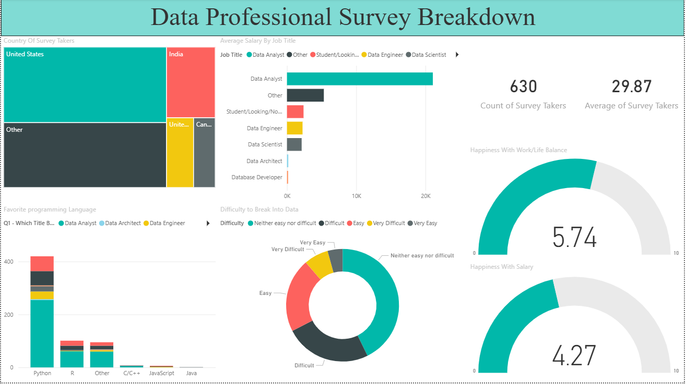
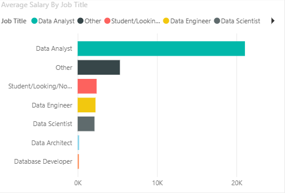
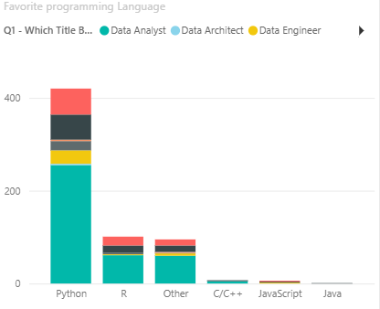

# Data Professional Survey Dashboard (Power BI)

## Project Overview

This project analyzes survey responses from data professionals to uncover trends in salaries, job satisfaction, work-life balance, and programming language preferences.

The dashboard was developed using Power BI and demonstrates data cleaning, transformation, visualization, and reporting techniques.

---

## Tools Used

- Power BI
- Power Query
- DAX
- Data Visualization
- Data Cleaning & Transformation

---

## Dataset Information

The dataset contains survey responses from data professionals and includes:

- Job Titles
- Salary Information
- Favorite Programming Languages
- Work-Life Balance Ratings
- Salary Satisfaction Ratings
- Demographic Information

---

## Data Preparation

The raw dataset required several cleaning and transformation steps:

- Standardized salary ranges
- Cleaned job title categories
- Created "Other" categories for low-frequency values
- Split and transformed text fields
- Calculated average salary values
- Prepared data for dashboard reporting

---

## Dashboard Features

### KPI Cards

- Average Salary
- Survey Respondent Count

### Visualizations

- Average Salary by Job Title
- Favorite Programming Languages
- Work-Life Balance Analysis
- Salary Satisfaction Analysis
- Country Distribution

### Interactive Features

- Dynamic Filtering
- Cross-Filtering
- Interactive Reporting

---

## Dashboard Preview

### Dashboard Overview

### Salary Analysis

### Programming Language Analysis

---

## Key Insights

- Data Scientists and Data Engineers reported higher average salaries.
- Python emerged as the most preferred programming language.
- Work-life balance ratings varied across job roles.
- Salary satisfaction showed noticeable differences between professional groups.

---

## Skills Demonstrated

- Power Query
- Data Cleaning
- Data Transformation
- Data Modeling
- DAX
- Dashboard Development
- Data Visualization
- Business Reporting

---

## Key Outcome

This project demonstrates an end-to-end Power BI workflow, from raw data preparation to interactive dashboard creation and business insight generation.
